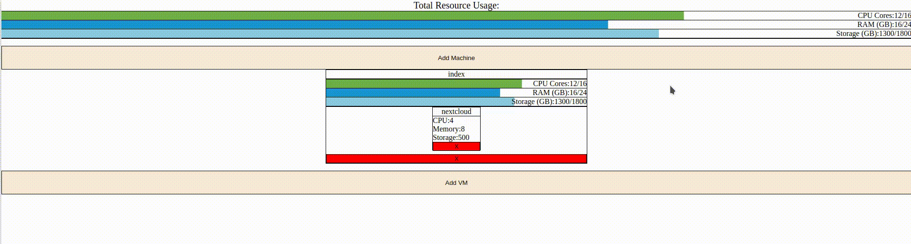
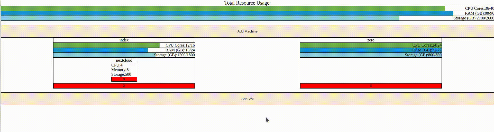
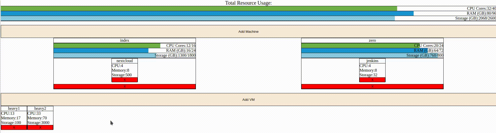
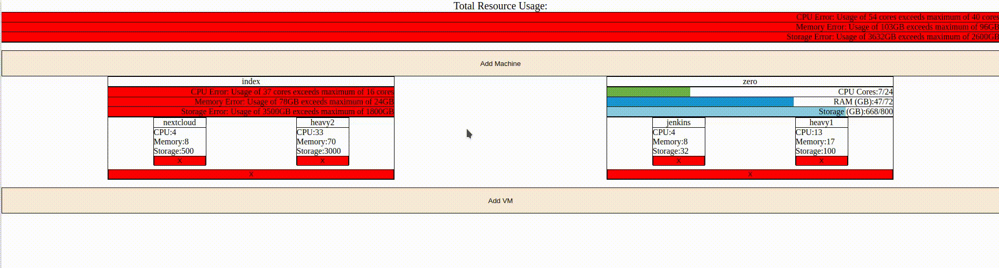

# vm-plan

vm-plan is a web app tool used to plan virtual machine usage and distribution across multiple physical machines
according to resource requirements.

You're able to create physical and virtual machines with resource requirements according to your specifications. You're
then able to drag the virtual machines around the different physical machines to have a visual way of planning resource
requirements.

## Download
To download and use this project, follow these steps:

* `git clone https://github.com/aveliz1999/vm-plan`
* `cd vm-plan`
* `npm install`
* `npm start`

 This will start the web server and serve the app on http://localhost:3000

 You can change the port with the `PORT` environment variable
 
## Usage

### Add machines
You can add more physical machines to have access to

### Add VMs
You can also add more virtual machines that will take up resources

### Move Around
You can move around the virtual machines into different machines and get immediate feedback on resource usage.
Dragging the virtual machine into a physical machine will make it become a part of that machine and use up its resources.

Dragging a virtual machine to a location without any physical machines will remove it and put it back in the initial pool
of unallocated virtual machines.

### Overload
If you drag a virtual machine into a machine that doesn't have enough resources it will highlight it red to warn you.
The same happens for the overall usage bars at the top if you try to use a VM that you don't have enough resources for
altogether.

### Delete
If you don't want a virtual machine or machine any longer you can press the red x at the bottom to delete it

